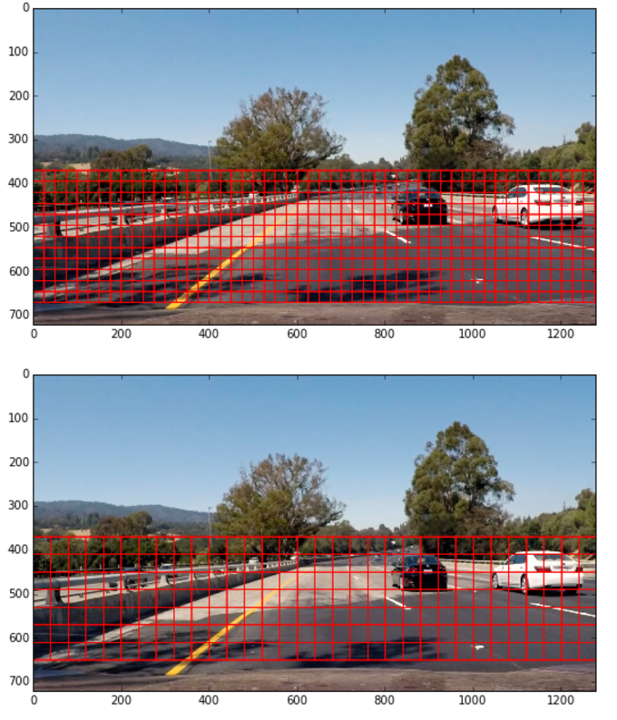
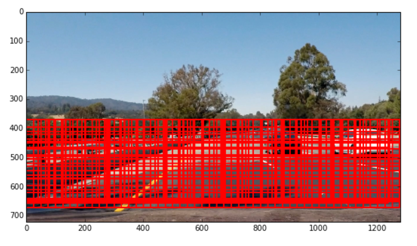
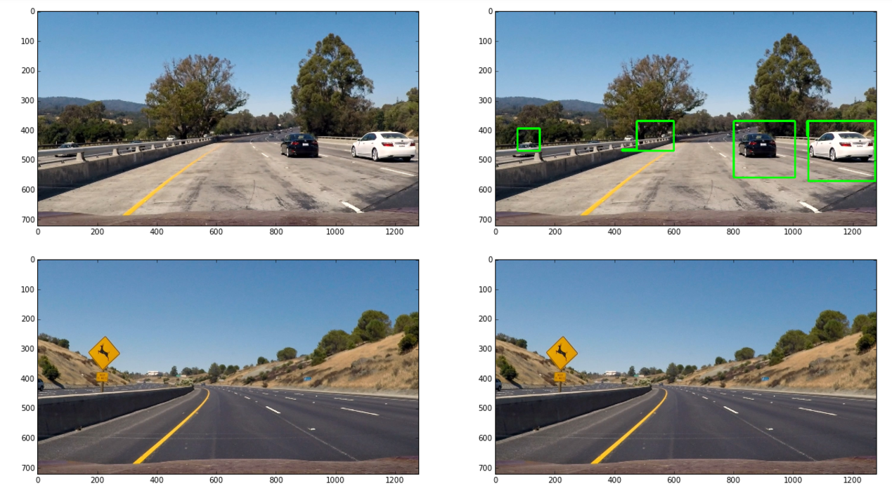

## <b>Udacity Self-Driving Nanodegree 

## Term 1- Final Project : Vehicle Detection
======================================================================

### Detect vehicles on test images and project video

All output image files are available in the location output_images and the final project video is project_video_out.mp4

> **The Steps in the Project are as following :**

> - Load the dataset and augment the positive images i.e. images that contain car by flipping those images. 
> - Split the dataset into training and test dataset.
> - Create a convolutional network network using tensor flow that trains the dataset on the training dataset.
> - Run the model on the training dataset and the test dataset and calculate the accuracy of the modal.
> - Select the region of interest in the image and slide windows to detect cars.
> - Apply heatmap to obtain the windows of interest.
> - Run the code on the video to detect vehicles.

## Load the dataset and augment the images

  The vehicle and non-vehicle data provided are loaded. In order to get a decent number of positive images, the positive dataset is
  augmented by flipping the images using openCV flip function.
  The code for this portion is available in cell 2 and 3 of the Ipython notebook.
  
## Split the dataset into training and test dataset

   The dataset is split into training and testing dataset. The code for this is available in cell 4 of the Ipython notebook.
   
## Create a convolutional network

   A convolutional network is created using Keras with Tensor flow as backend. The network is available in cell 5 of the Ipython notebook.
   The network can be described in the table below:
   
	<table style="width:100%; align:center;">
	  <tr>
		<th>Layer</th>
		<th>Description</th>    
	  </tr>
	  <tr>
		<td>Input</td>
		<td>64x64x3</td>    
	  </tr>
	  <tr>
		<td>Convolution</td>
		<td>8 filters,padding="VALID",kernel = 3x3</td>   
	  </tr>
	  <tr>
		<td>Activation</td>
		<td>RELU</td>   
	  </tr>
	  <tr>
		<td>MaxPooling2D</td>
		<td>Maxed pooled output and apply Batch Normalisation</td>   
	  </tr>
	  <tr>
		<td>Convolution</td>
		<td>16 filters,padding="VALID",kernel = 3x3</td>   
	  </tr>
	  <tr>
		<td>Activation</td>
		<td>RELU</td>   
	  </tr>
	  <tr>
		<td>MaxPooling2D</td>
		<td>Maxed pooled output and apply Batch Normalisation</td>   
	  </tr>
	  <tr>
		<td>Convolution</td>
		<td>64 filters,padding="VALID",kernel = 3x3</td>   
	  </tr>
	  <tr>
		<td>Activation</td>
		<td>RELU</td>   
	  </tr>
	  <tr>
		<td>MaxPooling2D</td>
		<td>Maxed pooled output and apply Batch Normalisation</td>   
	  </tr>
	  <tr>
		<td>Convolution</td>
		<td>32 filters,padding="VALID",kernel = 3x3</td>   
	  </tr>
	  <tr>
		<td>Activation</td>
		<td>RELU</td>   
	  </tr>
	  <tr>
		<td>MaxPooling2D</td>
		<td>Maxed pooled output and apply Batch Normalisation</td>   
	  </tr>
	  <tr>
		<td>Dropout</td>
		<td>Use dropout with a factor of 0.5</td>   
	  </tr>
	  <tr>
		<td>Flatten</td>
		<td>Flatten the output for fully connected layer</td>   
	  </tr>
	  <tr>
		<td>FullyConnected</td>
		<td>output = 256</td>   
	  </tr>
	  <tr>
		<td>Dropout</td>
		<td>Use dropout with a factor of 0.5</td>   
	  </tr>
	  <tr>
		<td>FullyConnected</td>
		<td>output = 1</td>   
	  </tr>
	  <tr>
		<td>Activation</td>
		<td>Sigmoid</td>   
	  </tr>	 
	</table>
	
## Run the dataset on the network

  The dataset is run on the network with a bacth size of  256 and 100 epochs. The test data is than run on the network and the accuracy obtaines is as follows:
  This is done in cell 11 of the Ipython notebook.
  
  6624/6638 [============================>.] - ETA: 0sTest accuracy: 0.988852063946
  
## Slide windows to detect cars

    Four windows have been chosen to detect cars on the image. The window sizes has been obtained by experiementation as below:
	
	 (50,50) , (80,80), (135,135), (190,190)

    Windows are slided through the test images an as they are slided, boxes are drawn on the image for each window. The result can be seen from the images below:
	
	<a>
Output of window one and two
</a>
	<a>
Output of window three and four
</a>
	
	As we see above, the windows cover the entire region of interest including the cars of different sizes.
	
    The result of all the windows combined on one single image can be seen below:
	
	<a>
Result of all windows on one another
</a>
	
## Heat map to classify desired windows

    Since the output of using window slides, outputs a large number of boxes which are of no interest to us, we apply the heat map to the output of the
	slide window to get boxes which actually contain cars. This is done by adding one pixel to each box and than apply a threshold to eliminate
	false positive.
	
	The output of heat map on a single image is as seen below:
	
	<a>
Result of the output windows
</a>
	
## Running the code on the output window

   The code is finally run on the output window and the output video file is project_video_out.mp4
   
## Problems and issues faced

    1) I faced issues when creating the network to reach an acceptable accuracy value. Large epochs and small batch sizes where taking extremely long  to run
	    which sometimes caused my PC to hang. Final with epoch 100 and batch size 256 I got a reasonable accuracy value.
		
	2) I started with two windows initially and the window sizes I chose initially did not perform well in detecting cars on all images and hence lot of areas on
       the image that did not contain vehicles were detected. Hence, I had to experiment with different window dimensions to arrive at a resoanble detection.
	   
	3) I started with HOG implementation earlier but it did an extremely poor job on the video and gave a lot of false positives which were hard to get rid off.
	   So, I switched to convolutional network which did a decent job in detecting vehicles.
	   
	4) I tried experimenting by saving heat maps of previous frames and than using it for the current frame, but in this particular video I did not see much 	
       difference in the output and hence I removed that to avoid unnecessary computation.
	
	
	
	

	
	
	
	
  